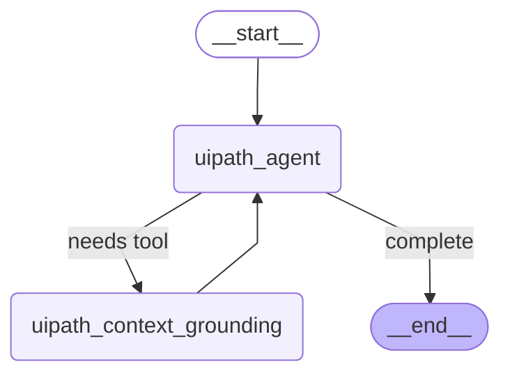

# UiPath LangGraph Agent

A simple example showing the pre-built react agent from LangGraph with UiPath managed LLMs (AITL) and Context Grounding using the uipath-langchain sdk.
This example highlights the value of extensibility through code, and interoperability with enterprise-grade UiPath artifacts.

UiPath SDK docs: https://uipath.github.io/uipath-python/

## Agent Flow

## Prerequisites

- **Python 3.8+**: Download from [python.org](https://www.python.org/downloads/) or use your system package manager
- **uv package manager**: Install with `pip install uv` or follow [uv installation guide](https://docs.astral.sh/uv/getting-started/installation/)

## Setup

1. Clone the repository
2. Run `uv sync` to install dependencies
3. Run `uipath auth` command to authenticate (don't forget the `--staging` flag if you're authenticating to a staging env)
4. RUn `uipath init` command to initialize
4. Set input values in `input.json`
5. Run `uipath run agent --file input.json` command to test locally in your IDE

## Deployment

- `uipath pack` - Package the agent
- `uipath publish` - Publish the agent

## Running from UiPath Orchestrator

Once the agent has been published, you can run it from UiPath Orchestrator.
1. Create a process from the published package
2. Run the process
3. Enter the uesr and system prompts
4. Set the Context Grounding index name
5. Copy the folder path 

